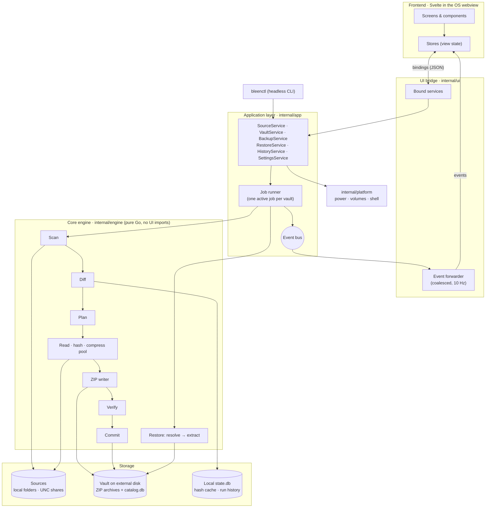
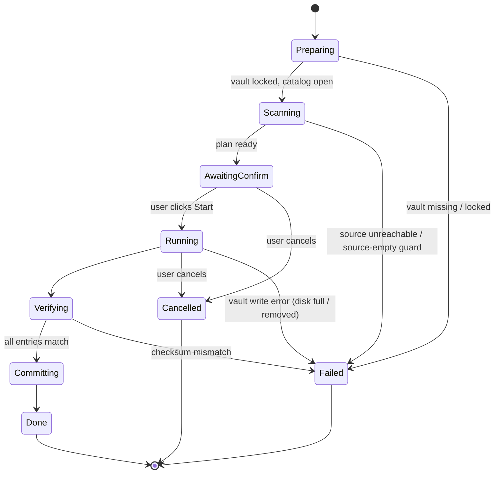
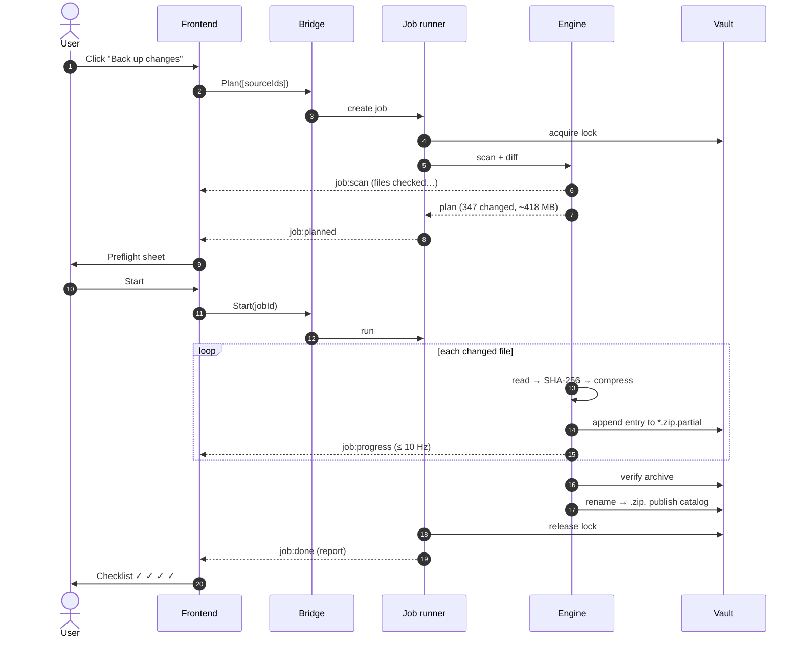
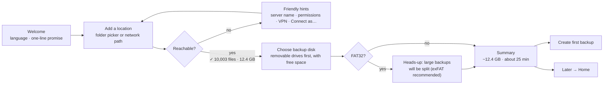
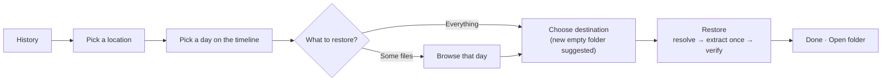

<p align="center">
  
</p>

<p align="center"><b>Dated copies of your folders, on a disk you own.</b><br>
Local-first · private · manual by default · restorable without bleen</p>

---

# bleen — Architecture

| | |
|---|---|
| **Status** | Draft 0.1 (pre-implementation) |
| **Last updated** | 2026-09-29 |
| **Derived from** | `backup-program.docx` (original requirements in Turkish, plus a C#/.NET 8/WPF prototype), re-architected for Go + Wails |
| **Audience** | Maintainers, contributors, reviewers |

> **How to read this document.** §0 lists what the original draft asked for and every place we changed it on purpose. §1–§6 cover the design. §7–§12 cover how we build, ship and run the project in the open. Decisions that are expensive to reverse are marked **[ADR-xxxx]** and indexed in Appendix A.

## Table of contents

0. [Requirements digest](#0-requirements-digest)
1. [Executive summary & philosophy](#1-executive-summary--philosophy)
2. [Tech stack & rationale](#2-tech-stack--rationale)
3. [System architecture](#3-system-architecture)
4. [Data models & storage](#4-data-models--storage)
5. [UI/UX architecture & design system](#5-uiux-architecture--design-system)
6. [Logo & identity](#6-logo--identity)
7. [Cross-platform strategy](#7-cross-platform-strategy)
8. [Security, privacy & reliability](#8-security-privacy--reliability)
9. [Testing & quality](#9-testing--quality)
10. [Repository layout & build](#10-repository-layout--build)
11. [Roadmap](#11-roadmap)
12. [Open-source readiness](#12-open-source-readiness)
- [Appendix A: ADR index](#appendix-a--adr-index)
- [Appendix B: Requirements traceability](#appendix-b--requirements-traceability)
- [Appendix C: Glossary (EN ↔ TR)](#appendix-c--glossary-en--tr)

---

## 0. Requirements digest

The original draft is a conversation that describes a simple Windows backup tool for a small office. The user wants to add network folders such as `\\SERVER\Root\_proje` to a list, point the tool at a portable disk, and take a **full backup the first time** and **only new and changed files after that**. Each backup is a **compressed ZIP**. Later the user picks **a day and a destination** and gets the folder back **exactly as it was on that day**.

### 0.1 Functional requirements

| ID | Requirement | Source in draft |
|---|---|---|
| FR-01 | Add several source locations: local folders **and network UNC paths** (`\\SERVER\Root\_proje`, `\\192.168.1.100\Root\_proje`), with no need to map a drive letter | Intro, "Konum ekleme", §6 |
| FR-02 | Pick a destination on a portable or external disk | Intro, "Yedekleme Diski" |
| FR-03 | The first backup of a source is a **full** backup | Intro, "Programın çalışma mantığı" |
| FR-04 | Later backups are **incremental** and contain only **new and modified** files | Intro, §4 |
| FR-05 | **Deletions are tracked**, so a restore does not bring deleted files back | "Silinen dosyalar konusu", §5 |
| FR-06 | Change detection uses **path, size, modification time and SHA-256**, not the date alone | "Yedekleme sistemi", final section |
| FR-07 | Each backup is stored as a **ZIP archive** named by date and type | Intro, §7 |
| FR-08 | Archives **describe themselves** (embedded metadata, a `files/` tree, a deleted list), so they still make sense on another computer | §8 |
| FR-09 | A SQLite metadata database with Sources, Backups, Files, BackupFiles and DeletedFiles tables | "Metadata" |
| FR-10 | A backup history showing date, type and size | "Restore / Export ekranı" |
| FR-11 | **Restore or export by date** into a chosen folder. The chain FULL + INCR… is applied automatically and the user never sees it | "Restore / Export ekranı", §4 |
| FR-12 | A **"Restore latest state"** shortcut | "Son halini geri getir" |
| FR-13 | A **preflight summary** before a run: last full, last incremental, new, modified, total and estimated size | "Kullanıcı deneyimini … basitleştirebiliriz" |
| FR-14 | First-run prompt: *"No full backup yet for this location. Create one?"* | same |
| FR-15 | **Progress**: current file, n / N files, percentage | Prototype UI §3 |
| FR-16 | **Verification**: the archive is checked with SHA-256 and a completion checklist is shown (✓ files ✓ size ✓ archive verified ✓ metadata updated) | "Bir özellik daha ekleyelim: doğrulama" |
| FR-17 | **Fault tolerance**: unreadable files are skipped, the run continues, and the report says **which file failed and why** | V1 list, prototype `catch` |
| FR-18 | A log screen and a log file | V1 list, `logs/backup.log` |
| FR-19 | **Manual only**: a backup runs only when the user clicks. There is **no background process** and no automatic backup | *Maintainer decision, 2026-09-29* |

**Future requirements (the draft's "V2" list)**: FR-20 scheduled backups, **opt-in only**. FR-21 automatic deletion of old backups. FR-22 backup policies. FR-23 encryption and password protection. FR-24 pause and resume. FR-25 several external disks. FR-26 backup reports. FR-27 system tray, **opt-in only**. FR-28 other formats such as 7-Zip or Zstandard.

### 0.2 Non-functional requirements

| ID | Requirement |
|---|---|
| NFR-01 | Cross-platform: Windows, macOS and Linux. **Windows with SMB shares is the primary use case.** |
| NFR-02 | Local-first. No account, no cloud and no telemetry. The only network traffic is reading the user's own sources. |
| NFR-03 | Crash-safe. A power cut, a crash or a pulled USB cable **never** damages backups that already exist. |
| NFR-04 | Recoverable without bleen: standard tools such as Explorer, 7-Zip or `unzip` can restore every backup. |
| NFR-05 | Performance: an incremental scan of 100k files over 1 GbE SMB takes ≤ 60 s. A USB 3 HDD runs at full speed on a 4-core laptop. |
| NFR-06 | Memory: the Go process stays under 200 MB RSS while backing up 1M files, because scan state spills to SQLite. |
| NFR-07 | Accessibility: WCAG 2.2 AA contrast, full keyboard control, screen-reader labels. |
| NFR-08 | Turkish and English at launch. |
| NFR-09 | The installer is small, with a target of < 25 MB, and needs no runtime install beyond the OS webview. |

### 0.3 Intentional changes from the draft

| Draft | This architecture | Why |
|---|---|---|
| C# + .NET 8 + WPF, Windows only | **Go + Wails + Svelte**, cross-platform | §2 · [ADR-0001] |
| Two buttons: *TAM YEDEK AL* / *GÜNLÜK YEDEK AL* | **One smart button**, "Back up now". It takes a full backup when none exists and backs up changes otherwise. "Start a fresh full backup" moves to a menu | The user should never have to choose the wrong one |
| `deleted/` folder inside the ZIP | Deletions recorded in the manifest, plus a human-readable `DELETED.txt` | Empty placeholder files confuse people who extract by hand |
| `backup.db` at the disk root | `.bleen/catalog.db` in a hidden system folder, **rebuildable from the archives** | The disk root stays tidy, and the index is never a single point of failure |
| Restore = extract FULL, then overlay each INCR | **Resolve the final state first, then extract each file once** | Faster, less wear on the disk, correct deletes · [ADR-0008] |
| `2026-09-26_INCREMENTAL.zip` | `2026-09-26_1800_INCREMENTAL.zip` | Allows more than one backup per day |
| Windows Task Scheduler integration (V2) | An opt-in **Automation** module, off by default, with no resident daemon even when it is on | FR-19 · [ADR-0006] |
| ALL-CAPS Turkish buttons | Sentence case | Avoids the Turkish dotted/dotless-I casing trap and reads calmer |

---

## 1. Executive summary & philosophy

**bleen** is a small, friendly desktop app that keeps **dated, verified copies of your folders**, including folders on office servers, **on a disk you own**. You click once and bleen copies what changed since last time into a standard ZIP file. You pick a day and bleen gives you that day's folder back.

### 1.1 Where the name comes from

In Nelson Goodman's *new riddle of induction* (1955), **"bleen"** is a made-up colour word: *blue before time t, green after it*. Backups are about exactly that: **the same thing, before and after a moment in time**. The brand keeps this idea: a bean that is blue on one side and green on the other (§6). It also sounds like *bean* and *clean*, which suits the tone.

### 1.2 Core tenets

1. **Local-first and private.** No account, no cloud and no telemetry. bleen only talks to the folders you point it at.
2. **Your files, not our format.** Backups are plain ZIP files. If bleen disappeared tomorrow, Explorer or 7-Zip could still restore everything.
3. **Nothing happens behind your back.** bleen runs only while its window is open. It installs no services, no startup entries, no tray icon and no scheduled tasks. Automation will only ever be an explicit opt-in.
4. **Never make things worse.** The vault is append-mostly, commits are atomic, and nothing is trusted until it is verified. A failed or cancelled run leaves every earlier backup untouched.
5. **Zero friction.** Three steps to the first backup. Plain language ("Back up changes", not "Run incremental job"). Sensible defaults everywhere.
6. **Delightful, never vague.** Charm lives in empty states, motion and the mascot. Numbers, errors and file names are always exact.

### 1.3 Non-goals (v1)

- Cloud or remote targets such as S3 or SFTP. Local, external and network-mounted disks only.
- Real-time sync, continuous protection or file watching.
- Disk imaging, bare-metal or OS restore.
- Multi-user or server deployment. bleen is a personal and small-office tool.

---

## 2. Tech stack & rationale

### 2.1 Stack at a glance

| Layer | Choice | Notes |
|---|---|---|
| Language | **Go ≥ 1.26** (releases built with the latest stable, currently 1.27) | Single static binary, goroutine pipelines, fast crypto |
| Desktop shell | **Wails v2.16** (v3 was still beta at M2; see ADR-0002) | Uses the OS webview (WebView2, WKWebView, WebKitGTK) · [ADR-0002] |
| Frontend | **Svelte 5 + TypeScript + Vite** | Compiled, tiny runtime, fine-grained reactivity · [ADR-0003] |
| Styling | **Tailwind CSS v4** with design tokens as CSS variables | Tokens in §5.5 |
| UI primitives | **Bits UI** (headless, accessible Svelte components) | Dialogs, menus, popovers, focus management |
| Icons | **Lucide** (ISC) | Rounded 1.75 px strokes that match the bean |
| i18n | **Paraglide JS** (inlang) | Type-safe messages, ICU plurals, Turkish + English |
| Archive | `archive/zip` (stdlib) + **klauspost/compress** | Parallel deflate, `CreateRaw` for pre-compressed entries, zstd later |
| Hashing | `crypto/sha256` | Hardware-accelerated (SHA-NI and ARMv8), interoperable with `sha256sum` |
| Metadata DB | **SQLite** via `modernc.org/sqlite` (no cgo) | Migrations with `pressly/goose`, typed queries with `sqlc` |
| Config | **TOML** (`pelletier/go-toml/v2`) | Human-editable, supports comments |
| CLI | `spf13/cobra` | `bleenctl`, headless, pure Go |
| Logging | `log/slog` (JSON lines) + `natefinch/lumberjack` rotation | Also shown in the Activity screen |
| Disk info | `shirou/gopsutil/v4` | Volumes, free space, filesystem type |
| Encryption (v0.4) | **`filippo.io/age`** | Audited, simple, has a CLI for recovery without bleen · [ADR-0007] |
| Native SMB (v0.5) | `hirochachacha/go-smb2` | macOS and Linux sources without mounting |
| Keychain (v0.2+) | `zalando/go-keyring` | Windows Credential Manager, macOS Keychain, Secret Service |
| Build & release | Taskfile + Wails packaging + **GoReleaser**, GitHub Actions | Signed and notarized artifacts |
| Quality | `golangci-lint` (with `depguard` layer rules), `govulncheck`, `svelte-check`, ESLint, Prettier, Vitest, Playwright | §9 |

### 2.2 Why Go instead of the draft's C#/.NET  [ADR-0001]

.NET 8 is an excellent platform, and the draft's WPF prototype was a reasonable start. We are changing stacks for **reach and product-design reasons**, not because .NET is weak:

| Concern | C# / .NET 8 / WPF (draft) | Go + Wails |
|---|---|---|
| Platforms | WPF is Windows-only. Cross-platform means a rewrite in Avalonia or MAUI | Windows, macOS and Linux from one codebase |
| Distribution | Needs the .NET runtime, or a self-contained build that is tens of MB larger | One binary that uses the webview already on the OS |
| Concurrency model | `async`/`Task`, which is fine | Goroutines + channels map 1:1 onto a *scan → read → hash → compress → write* pipeline |
| Headless reuse | Possible | The core engine is **cgo-free pure Go**, so `bleenctl` cross-compiles to any OS/arch, including ARM NAS boxes |
| UI freedom | XAML styling | The full web design toolbox (CSS, motion, SVG) for the *Linear × Raycast* feel |
| Contributor pool | .NET desktop developers | Go + web developers, a very large open-source pool |

### 2.3 Why Wails  [ADR-0002]

| Option | Verdict |
|---|---|
| **Electron** | Bundles Chromium. Installer ≥ 100 MB, idle RAM in the hundreds of MB. Against NFR-09. |
| **Tauri** | Excellent, but the core is Rust. We want one language for the engine and the shell. |
| **Fyne / Gio** (pure Go UI) | Custom-drawn widgets. Reaching the intended visual polish and accessibility is much harder. |
| Native per OS | Three UIs to build and keep in sync. |
| **Wails** ✅ | Go backend, web frontend, OS webview, generated TypeScript bindings, small binaries. |

**Version gate:** use **Wails v3** if a stable (non-alpha) release exists when milestone M2 starts, because it has better service bindings, multi-window support and native tray support for later opt-in features. Otherwise use **Wails v2.x**, which covers everything a single-window manual app needs. All Wails-specific code lives in `internal/ui`, so moving from v2 to v3 affects only that package.

**Known risk:** the three webviews differ in rendering. Mitigations: avoid bleeding-edge CSS, especially for WebKitGTK on Ubuntu LTS; run visual snapshot tests on all three OSes in CI; bundle all fonts locally.

### 2.4 Why Svelte  [ADR-0003]

bleen's frontend is mostly **live state**: progress at 10 Hz, per-card status, a ticker of the current file. Svelte 5 runes update only the DOM nodes that change and ship almost no runtime. The code is also approachable for occasional contributors. React + Vite is an acceptable alternative and would change nothing outside `frontend/`.

### 2.5 Why SQLite (not BoltDB)

The catalog needs **relational queries**: "state of this folder at snapshot 12", history aggregates, per-snapshot statistics and fast lookups by path. SQLite gives us indexes, transactions, and a file that users and debuggers can open with `sqlite3`. BoltDB is a key-value store, so we would end up rebuilding secondary indexes by hand. The draft already chose SQLite.

### 2.6 Why ZIP (not a chunked repository like restic or borg)  [ADR-0004]

The draft asks for ZIP explicitly (FR-07), and tenet 2 requires backups to be openable without bleen. The trade-off is that there is **no deduplication inside files**. We reduce the cost in three ways:

- **Unchanged content is not copied again.** A file whose date changed but whose content did not is recorded as a reference to its earlier bytes (§3.3.2). Moved and copied files are stored again on purpose, so hand extraction always works.
- **Smart compression.** Already-compressed types (JPG, MP4, ZIP, DOCX/XLSX, PDF…) are *stored* and not re-deflated, which saves CPU for no loss of space.
- **Generations** (§3.3.9) keep incremental chains short.

A chunked "vault format v2" could be considered after 1.0 if users need it. It must never cost us openability.

**Why not one growing ZIP with a folder per date?** ZIP compresses each file on its own, so one big ZIP compresses no better than one ZIP per run. Appending to a single ZIP also means rewriting its central directory every time; a crash or an unplugged disk at that moment could make *every* backup unreadable, instead of only the unfinished run. A single file would also hit FAT32's 4 GiB limit, and old backups could never be deleted without rewriting the whole file. One archive per run keeps each failure small and each step reversible.

---

## 3. System architecture

### 3.1 Process model: manual first  [ADR-0006]

| Binary | What it is | When it runs |
|---|---|---|
| `bleen` | The desktop app: Wails window + engine | **Only while the user has it open** |
| `bleenctl` | Headless CLI using the same engine and the same vault format | Only when a person or script calls it |

- **Opening the app** starts one process. The engine runs in goroutines inside it.
- **Closing the window exits the process.** If a job is running, bleen asks: *"A backup is running. Stop it and quit?"* with **Keep backing up** or **Stop & quit**. Stopping cancels the job's context. The unfinished `*.partial` archive is deleted and **no earlier backup is affected** (§3.3.7).
- bleen installs **no** services, login items, tray icons, scheduled tasks or file watchers. A CI test asserts that no OS-integration path runs unless the Automation module is explicitly enabled.
- **Future Automation (opt-in, v0.5+)** does not add a daemon either. It registers one OS-native scheduled job that calls `bleenctl run`, shows the user exactly what it registered, and removes it cleanly (§3.6).

### 3.2 Component diagram



**Dependency rule, enforced by `depguard` in CI:**

```
ui ─┐
cli ─┼─► app ─► engine ─► { archive, catalog, vault, source }
     │     └──► platform, config, events
     └──────── nothing imports ui or cli
```

`engine` never imports Wails, Cobra or anything UI-related. It reports progress through an `events.Sink` interface that is injected at construction.

### 3.3 Core backup engine

#### 3.3.0 Job lifecycle



`AwaitingConfirm` is the **preflight** screen (FR-13). A setting can skip it ("Start right away next time"), but the **mass-change guard** (§3.3.3) always brings it back.

#### 3.3.1 Scan

- **Parallel directory walker.** On SMB, listing directories costs round trips, so latency dominates. We list up to `N` directories at a time: 8 for network sources and 4 for local ones, adjustable in Advanced settings.
- **No per-file `stat` on Windows.** Directory enumeration already returns size, mtime and attributes, so a 100k-file share needs about one round trip per directory, not one per file.
- **Filters.** Gitignore-style patterns. The defaults exclude junk that office users have plenty of: `~$*` (Office lock files), `Thumbs.db`, `desktop.ini`, `.DS_Store`, `*.tmp`, `$RECYCLE.BIN/` and `System Volume Information/`.
- **Special entries.** Symlinks and junctions are **recorded, not followed**, which prevents loops. Cloud placeholders (OneDrive "files on demand", with `RECALL_ON_DATA_ACCESS` or `OFFLINE` attributes) are skipped with a note by default, so a backup never triggers gigabytes of downloads.
- **Bounded memory.** Results stream into a scratch table in the local `state.db` in batches of 10k rows per transaction. A 1M-file source never has to fit in RAM (NFR-06).
- **Live feedback.** The UI shows *"Looking for changes… 12,408 files checked"* while the scan runs.

#### 3.3.2 Diff: classifying changes

The diff is a SQL join between the scratch scan table and the source's **current state** in the catalog:

| Class | Rule | What gets stored |
|---|---|---|
| **unchanged** | Same size **and** same mtime (fast path) | Nothing |
| **new** | Path not in the current state | Bytes |
| **modified** | Size or mtime differs **and** the SHA-256 differs | Bytes |
| **touched** | Size or mtime differs but the SHA-256 is **equal** | Metadata only (new mtime) |
| **deleted** | In the current state, missing from the scan | A deletion record (FR-05) |
| **moved / copied** | New path (a move is recorded as *added* + *deleted*) | Bytes, stored again. Referencing older archives would save space, but then extracting the ZIPs by hand would miss the file, which breaks tenet 2 |

- **SHA-256 is part of detection (FR-06), but without re-reading everything every day.** Unchanged files take the size+mtime fast path, as git and restic do. Candidates for change are hashed while they are read for archiving, so they are read **once** (§3.3.4). A **"Deep check"** action, available on demand, re-hashes every file for users who want certainty.
- **Local hash cache.** `state.db` remembers `(path, size, mtime) → sha256` per source, so the fast path works even the first time a vault is opened on this machine.

#### 3.3.3 Plan and safety guards

The plan becomes the preflight summary (FR-13, FR-14):

```
Last full backup      25.09.2026
Last backup           28.09.2026 18:00
─────────────────────────────────
New files                  52
Changed files             295
Deleted files               4
Estimated size         ~418 MB   (disk has 412 GB free)
Estimated time          ~2 min
```

- **Estimated size** is the sum of bytes to store multiplied by the source's historical compression ratio (0.7 when there is no history). **Estimated time** comes from the last run's throughput.
- **Free-space check.** The run is blocked if the estimate × 1.1 is more than the free space. The message explains what to do.
- **Source-empty guard (critical).** If a source root is unreachable, or suddenly lists **zero** entries, the run **fails** and records nothing. A disconnected share must never be read as "everything was deleted".
- **Mass-change guard.** If more than 30% of files changed or were deleted (configurable), preflight shows a warning card: *"Unusually many changes: 8,412 of 10,003 files. This can mean ransomware or a wrong folder. Check before continuing."* The user has to confirm explicitly.

#### 3.3.4 Pipeline: read → hash → compress → write

```
                    ┌──────────────┐
 plan (SQLite) ───► │ reader pool  │  I/O-bound · network: 4, local SSD: 4, HDD: 2
                    └──────┬───────┘
                           │ io.TeeReader
              ┌────────────┴────────────┐
              ▼                         ▼
        sha256.Hash              compressor (deflate / store)
                                         │ spool: RAM ≤ 4 MB, else temp file
                                         ▼
                           ┌─────────────────────────┐
                           │ single ZIP writer       │  zip.Writer.CreateRaw(
                           │ (sequential, ordered by │     precomputed CRC32,
                           │  completion)            │     sizes, method)
                           └───────────┬─────────────┘
                                       ▼
                      2026-09-26_1800_INCREMENTAL.zip.partial
```

- **Parallel compression, sequential archive.** Workers compress entries independently. A single writer appends them with `CreateRaw`, so a ZIP is always written by one goroutine while every CPU core compresses.
- **Memory budget.** A weighted semaphore caps spool memory at 256 MB by default. Large files spool to a temp file on the **local** disk.
- **Compression policy.** Deflate level 6 via klauspost/compress. Known incompressible extensions are **stored**. For unknown types, if the first 64 KB compress by less than 3%, the entry is stored.
- **Opening files politely (Windows).** Files are opened with `FILE_SHARE_READ | FILE_SHARE_WRITE | FILE_SHARE_DELETE` so bleen **never blocks colleagues** who work on the share while it reads.
- **Locked files.** On a sharing violation, retry after 1 s, 3 s and 10 s, then skip with `E_FILE_LOCKED` (FR-17).
- **Torn-read check.** Size and mtime are checked before and after reading. If they differ, the file changed during the read: retry twice, then skip with `E_FILE_UNSTABLE`. We never store a half-written file as if it were good.
- **Per-file errors never abort a run.** Only these do: the vault becomes unwritable (disk full or removed), the source root disappears, or the catalog fails. In each case the `.partial` file is deleted and nothing is committed.
- **Cancellation** goes through `context.Context`. **Pause** (v0.5) is a gate the readers wait on.
- **Sleep prevention.** While a job runs, the platform layer keeps the machine awake (§7).

```go
// internal/engine/pipeline.go (sketch)
type Task struct {
    Rel      string // "klasor/resim.jpg"
    Size     int64
    ModTime  time.Time
    PrevHash []byte // for modified candidates; nil for new files
}

type Result struct {
    Task
    SHA256  [32]byte
    CRC32   uint32
    Method  uint16 // zip.Store or zip.Deflate
    Spool   Spool  // compressed bytes (memory or temp file)
    Touched bool   // content identical to PrevHash → metadata only
    Err     *FileError
}

func (p *Pipeline) Run(ctx context.Context, tasks <-chan Task, w *archive.Writer) (Report, error)
```

#### 3.3.5 Archive format: *bleen archive v1*  [ADR-0004]

**Naming:** `<local date>_<HHmm>_<KIND>.zip`, for example `2026-09-25_1830_FULL.zip` or `2026-09-26_1800_INCREMENTAL.zip`. Timestamps inside the manifest are in UTC.

**Inside every archive:**

```
2026-09-26_1800_INCREMENTAL.zip
├── files/                    new and modified files, original relative paths
│   ├── dosya2.xlsx
│   └── klasor/resim.jpg
├── DELETED.txt               plain list of paths deleted since the previous backup
└── bleen-manifest.json       machine-readable, authoritative (§4.6)
```

- **Filenames are UTF-8** (the ZIP UTF-8 flag is set), so Turkish names like `ığüşöç.xlsx` survive in Explorer, macOS Archive Utility, 7-Zip and `unzip`. Paths use `/`, are relative and NFC-normalized.
- **ZIP64** switches on automatically for archives > 4 GiB or > 65,535 entries.
- **Modification times** are stored in the extended-timestamp extra field and restored.
- **Split archives on FAT32.** Many USB sticks ship as FAT32, which has a **4 GiB file-size limit**. bleen detects the target filesystem and rolls to `…_FULL.part02.zip` and so on at 3.9 GiB. **Every part is a complete, standalone ZIP**, not a spanned archive, so any tool can open any part. Onboarding recommends exFAT (§5.4).
- **Moved or copied files** (§3.3.2) are stored again under their new path, so extracting the archives by hand gives complete folders. The one exception is a file whose date changed but whose content did not: an incremental records it as a reference to the bytes already stored for the same path. A full backup always stores every file.

**Restoring without bleen** (also on the website's FAQ): *extract the FULL archive, then each INCREMENTAL in date order and overwrite when asked, then delete the paths listed in each `DELETED.txt`.*

#### 3.3.6 Verification (FR-16)

After writing and `fsync`, the archive is **re-opened from disk**:

1. Parse the central directory. Its entry count and names must match the manifest.
2. Decompress every entry. The CRC-32 must match (ZIP-level integrity).
3. Compute the SHA-256 of the decompressed bytes. It must match the hash taken **from the source** while reading (end-to-end integrity).
4. Compare the manifest's archive-level SHA-256 with a fresh hash of the file.

The completion screen shows the checklist from the draft: *✓ 347 files backed up · ✓ 418 MB archived · ✓ archive verified · ✓ catalog updated*. The verify level can be set to `full` (default) or `quick` (structure plus a sample). It can never be turned off from the UI.

The **Check backups** action (v0.3) re-runs step 2 to step 4 on any archive later, to catch bit rot on old disks.

#### 3.3.7 Commit protocol: crash safety (NFR-03)

```
1. write   <name>.zip.partial                          fsync(file)
2. verify  (§3.3.6)
3. rename  <name>.zip.partial → <name>.zip             fsync(dir)
4. catalog transaction: snapshot + file_versions + archives, status=committed
5. publish catalog: catalog.db.tmp → fsync → keep catalog.db as catalog.db.1 → rename
6. append run log
```

| Crash after step… | State on next open | Automatic recovery |
|---|---|---|
| 1–2 | Stray `.partial` file | Deleted. Earlier backups untouched. |
| 3–4 | Archive on disk, not in the catalog | **Re-imported from its embedded manifest**. Nothing lost. |
| 5 | `catalog.db.tmp` present | Discarded. The previous `catalog.db` is still valid, and the archive is re-imported as above. |

The catalog is edited as a **working copy in local app data**, which is fast and never on the USB bus mid-transaction, and then published to the vault atomically. A `revision` counter in the catalog decides which copy is newer when the same disk is used on several machines.

#### 3.3.8 Restore engine: resolve, then extract  [ADR-0008]

**Input:** source, a point in time (snapshot), a selection (everything, or selected folders and files), a destination, and a conflict policy.

1. **Resolve** the exact file set at snapshot `S` with one query (§4.3). The result already accounts for every modification, deletion and move in the chain.
2. **Group by archive and sort by offset**, so each archive is read sequentially, which matters on USB HDDs.
3. **Extract** each needed entry **exactly once**, however long the chain. Each file is written to `name.bleen-tmp`, its SHA-256 verified, its mtime set, and then renamed into place.
4. Create empty directories, then set directory mtimes last.
5. Report: *"✓ 10,003 files restored to D:\Restore\Proje · all verified"*.

- **Restore latest** (FR-12) is the same operation with `S` set to the newest snapshot.
- **Destination** is a **new, empty folder** (`…\_proje (2026-09-27 1800)` on the Desktop by default). The app refuses a folder that already has files and a folder inside the vault; `bleenctl restore --overwrite` allows a non-empty folder. A restore never deletes anything at the destination.
- **Export as one ZIP** is the same operation with a different writer: the resolved files go into one new ZIP (paths relative to the source folder, original dates). Compressed data is copied as is, after each file's SHA-256 is checked. The ZIP is written as `name.zip.partial` and renamed at the end, so a cancelled export leaves nothing. It is never encrypted, even from an encrypted vault, and the app says so.
- **Path safety.** Entries with `..`, absolute paths or drive letters are rejected (zip-slip). Names that are illegal on the target OS, such as `CON`, `aux.txt` or trailing dots on Windows, are escaped, and the report lists them.

#### 3.3.9 Generations and retention (v0.3)

Incremental chains grow forever unless something resets them. A **generation** is one FULL plus its incrementals.

- A new generation starts when the user chooses **"Start a fresh full backup"**, or, if they opt in, when the chain passes 60 incrementals or its total size passes the size of the FULL.
- **Retention only removes whole generations, oldest first.** No archive is ever rewritten, so pruning cannot corrupt a chain. The newest generation can never be removed.
- A synthetic full, merging increments into a new full without re-reading the source, is a post-1.0 idea.
- Low-space warnings appear when free space drops below 10% or below the next estimated run.

### 3.4 Sources

```go
// internal/source/source.go
type Source interface {
    ID() string
    Root() string                                        // `\\SERVER\Root\_proje`
    Probe(ctx context.Context) (ProbeInfo, error)        // reachable? file count hint
    Walk(ctx context.Context, fn WalkFunc) error         // parallel, streaming
    Open(ctx context.Context, rel string) (File, error)  // share-friendly open
    Stat(ctx context.Context, rel string) (Entry, error)
    CaseSensitive() bool
}
```

| Driver | Covers | Milestone |
|---|---|---|
| `localfs` | Local folders; **UNC paths on Windows**; mounted shares on macOS (`/Volumes/…`) and Linux (CIFS, GVFS) | M1 |
| `smb` | Native SMB2/3 client, so macOS and Linux can back up `smb://server/share` without mounting it | v0.5 |

- **UNC paths (FR-01).** Paths like `\\SERVER\Root\_proje` and `\\192.168.1.100\Root\_proje` are accepted directly, with no drive mapping. Internally they are converted to extended-length form (`\\?\UNC\…`), so paths longer than 260 characters work.
- **Credentials.** By default the share is accessed with the logged-in Windows session, as the draft specifies. If access is denied, **"Connect as…"** (v0.2) establishes the connection with a username and password kept in Windows Credential Manager, never in config files.
- **Status probe.** While the app is open, each source card checks reachability with a single `stat` every 60 s: *Reachable* or *Can't reach SERVER*.

### 3.5 Vault (backup target)

The **vault** is the bleen folder on the target disk. The layout keeps the draft's human-readable structure and moves the machinery into a hidden folder:

```
E:\bleen\
├── _proje\
│   ├── 2026-09-25_1830_FULL.zip
│   ├── 2026-09-26_1800_INCREMENTAL.zip
│   └── 2026-09-27_1805_INCREMENTAL.zip
├── muhasebe\
│   ├── 2026-09-25_1842_FULL.zip
│   └── 2026-09-26_1811_INCREMENTAL.zip
└── .bleen\                         (hidden)
    ├── vault.json                  identity, format version
    ├── catalog.db                  index (rebuildable from archives)
    ├── catalog.db.1                previous revision
    ├── lock                        who is writing: host, pid, since
    └── logs\2026-09.jsonl
```

- **Found by identity, not by drive letter.** `vault.json` holds a UUID. If the disk shows up as `F:` next time, bleen finds it by scanning mounted volumes and says *"Blue SanDisk is connected"*.
- **Name collisions.** Two sources called `_proje` from different servers get `_proje` and `_proje (SERVER2)`.
- **Locking.** An exclusive OS lock plus the `lock` file prevent two bleen instances, or two machines, from writing at once. Stale locks from dead processes are detected and can be broken with confirmation.
- **Several machines, one disk.** Supported. Sources carry a `host` field.
- **Filesystem detection.** FAT32 triggers archive splitting and a friendly onboarding hint. Network-mounted vaults work but get a note that local disks are faster.

### 3.6 Scheduler & tray: future, opt-in only  [ADR-0006]

Per FR-19, **v1 ships without any scheduler, daemon or tray.** The architecture keeps room for the draft's V2 items without compromising that.

- `internal/automation` is a separate package, enabled only by `automation.enabled = true` in the config, which only the UI toggle sets.
- When enabled, it registers **one** OS-native job and **no resident process**:

| OS | Mechanism | Catch-up after sleep or power-off |
|---|---|---|
| Windows | Task Scheduler task `\bleen\backup` that runs `bleenctl run --all --notify` | "Run task as soon as possible after a scheduled start is missed" |
| macOS | `~/Library/LaunchAgents/app.bleen.backup.plist` with `StartCalendarInterval` | launchd runs missed intervals after wake |
| Linux | `systemd --user` timer + service | `Persistent=true` |

- The settings screen shows **exactly** what was registered and where. Disabling it, or uninstalling bleen, removes it.
- **Tray (FR-27)** would come later as a separate opt-in. It only makes sense with Wails v3.

### 3.7 Application layer & UI bridge

#### 3.7.1 Application services (`internal/app`)

| Service | Key methods |
|---|---|
| `SourceService` | `List`, `Add(path)`, `Validate(path) → ProbeInfo`, `Rename`, `Remove`, `SetExcludes` |
| `VaultService` | `Candidates()` (removable drives first), `Create(path)`, `Open(path)`, `Current()`, `Doctor()` |
| `BackupService` | `Plan(sourceIDs) → JobID`, `Start(jobID)`, `Cancel(jobID)`, `StartFreshFull(sourceID)` |
| `RestoreService` | `Snapshots(sourceID)`, `Browse(snapshotID, dir)`, `Plan(req)`, `Start(jobID)`, `Cancel(jobID)` |
| `HistoryService` | `Runs(filter)`, `RunDetail(runID)`, `Issues(runID)`, `ExportReport(runID, fmt)` |
| `SettingsService` | `Get`, `Update(patch)`, `Language`, `Theme` |

The **job runner** allows at most one active job per vault. "Back up all" runs its sources **one after another**, which is friendlier to office networks and USB disks.

#### 3.7.2 Bridge contract (Go ⇄ Svelte)

- **Commands** are Wails-bound methods that return JSON DTOs. Long operations return a `JobID` immediately, and progress arrives as events.
- **Events** go through one forwarder that coalesces and throttles them:

| Event | Payload | Rate |
|---|---|---|
| `job:state` | `{jobId, state, reason?}` | On change |
| `job:scan` | `{jobId, filesChecked, dirsChecked}` | ≤ 5 Hz |
| `job:planned` | `Plan` DTO (counts, bytes, estimates, warnings) | Once |
| `job:progress` | `{jobId, filesDone, filesTotal, bytesDone, bytesTotal, currentFile, throughput, etaSec}` | ≤ 10 Hz, latest wins |
| `job:issue` | `{jobId, path, code, message}` | Batched every 250 ms |
| `job:done` | `RunReport` DTO | Once |
| `vault:changed` | `{vaultId, connected, freeBytes}` | On change (polled every 3 s while the window is focused) |
| `source:status` | `{sourceId, reachable, lastBackupAt}` | On change |

- **Errors** use one envelope, `{code, message, details, retryable}`. The frontend maps each `code` (for example `E_SOURCE_UNREACHABLE`, `E_VAULT_FULL`, `E_FILE_LOCKED`, `E_FILE_UNSTABLE`, `E_ACCESS_DENIED`, `E_CHECKSUM_MISMATCH`, `E_VAULT_LOCKED`) to localized, friendly text **with a next step**.
- **Security of the bridge.** The webview loads only embedded assets under `default-src 'self'`. There are no remote URLs and no generic "read file" or "exec" bindings. Every path argument is validated in Go.

```go
// internal/ui/backup_bridge.go (illustrative; exact API follows the pinned Wails version)
type BackupBridge struct{ app *app.App }

func (b *BackupBridge) Plan(sourceIDs []string) (dto.JobID, error) { return b.app.Backup.Plan(sourceIDs) }
func (b *BackupBridge) Start(id dto.JobID) error                    { return b.app.Backup.Start(id) }
func (b *BackupBridge) Cancel(id dto.JobID) error                   { return b.app.Backup.Cancel(id) }
```

```ts
// frontend/src/lib/stores/job.svelte.ts
import { Plan, Start } from '$bindings/backupbridge';
import { Events } from '@wailsio/runtime';

export const job = $state({ state: 'idle', progress: null as Progress | null });
Events.On('job:progress', (e) => (job.progress = e.data));
Events.On('job:state',    (e) => (job.state = e.data.state));
```

#### 3.7.3 A backup run end to end



---

## 4. Data models & storage

### 4.1 Where things live

| Data | Location | Format | Authoritative? |
|---|---|---|---|
| App settings | `%APPDATA%\bleen\config.toml` · `~/Library/Application Support/bleen/config.toml` · `$XDG_CONFIG_HOME/bleen/config.toml` | TOML | Yes (this machine) |
| Local state | Same folder, `state.db` | SQLite | **No.** A disposable cache |
| Archives | `<vault>/<source>/*.zip` | ZIP + manifest | **Yes: the source of truth** |
| Catalog | `<vault>/.bleen/catalog.db` | SQLite | Derived. **Rebuildable from the manifests** |
| Vault identity | `<vault>/.bleen/vault.json` | JSON | Yes |
| Logs | Local `logs/` and `<vault>/.bleen/logs/` | JSON lines | For diagnostics |

### 4.2 Domain model

```go
// internal/engine/model.go
type Source struct {
    ID, Name, Origin, Host, Folder string // Origin: `\\SERVER\Root\_proje`
    CaseSensitive bool
    Excludes      []string
}

type Snapshot struct {
    ID           string   // UUID
    SourceID     string
    Generation   int64
    Seq          int      // 0 = FULL, 1.. = INCREMENTAL within the generation
    Kind         Kind     // Full | Incremental
    StartedAt    time.Time
    FinishedAt   time.Time
    Stats        Stats    // New, Modified, Deleted, Moved, Touched, Skipped, BytesSource, BytesStored
    Archives     []ArchiveRef
}

type FileVersion struct {
    Path       string   // "klasor/resim.jpg" (relative, '/', NFC)
    Kind       EntryKind
    Size       int64
    ModTime    time.Time
    SHA256     [32]byte
    FromSeq    int      // first snapshot where this version is current
    ToSeq      *int     // snapshot where it stopped being current (nil = still current)
    EndReason  EndReason // Modified | Deleted | Moved
    Archive    ArchiveRef // where the bytes live (may be an older archive)
    EntryName  string
}

type FileIssue struct {
    Path, Code, Message string
    Attempts            int
}
```

### 4.3 Catalog schema (`catalog.db`)

The draft's tables map as follows: **Sources → `sources`**, **Backups → `snapshots`**, **Files + BackupFiles → `file_versions`**, and **DeletedFiles → the view `deleted_files`**. Each file version carries a *validity interval* `[from_seq, to_seq)`, so "the folder as it was on day X" is one indexed query.

```sql
PRAGMA foreign_keys = ON;

CREATE TABLE meta (
  key   TEXT PRIMARY KEY,              -- schema_version, vault_id, revision
  value TEXT NOT NULL
);

CREATE TABLE sources (
  id             INTEGER PRIMARY KEY,
  uuid           TEXT NOT NULL UNIQUE,
  name           TEXT NOT NULL,        -- "_proje"
  origin         TEXT NOT NULL,        -- "\\SERVER\Root\_proje"
  host           TEXT NOT NULL,        -- machine that backs it up
  folder         TEXT NOT NULL UNIQUE, -- folder name inside the vault
  case_sensitive INTEGER NOT NULL DEFAULT 0,
  created_at     INTEGER NOT NULL      -- unix ms
);

CREATE TABLE generations (
  id         INTEGER PRIMARY KEY,
  source_id  INTEGER NOT NULL REFERENCES sources(id),
  started_at INTEGER NOT NULL,
  retired_at INTEGER                    -- set when pruned
);

CREATE TABLE snapshots (
  id             INTEGER PRIMARY KEY,
  uuid           TEXT NOT NULL UNIQUE,
  source_id      INTEGER NOT NULL REFERENCES sources(id),
  generation_id  INTEGER NOT NULL REFERENCES generations(id),
  seq            INTEGER NOT NULL,      -- 0 = FULL
  kind           TEXT NOT NULL CHECK (kind IN ('full','incremental')),
  started_at     INTEGER NOT NULL,
  finished_at    INTEGER NOT NULL,
  files_total    INTEGER NOT NULL,
  files_new      INTEGER NOT NULL,
  files_modified INTEGER NOT NULL,
  files_deleted  INTEGER NOT NULL,
  files_moved    INTEGER NOT NULL,
  files_skipped  INTEGER NOT NULL,
  bytes_source   INTEGER NOT NULL,
  bytes_stored   INTEGER NOT NULL,
  UNIQUE (generation_id, seq)
);

CREATE TABLE archives (
  id          INTEGER PRIMARY KEY,
  snapshot_id INTEGER NOT NULL REFERENCES snapshots(id),
  part        INTEGER NOT NULL DEFAULT 1,
  filename    TEXT NOT NULL,           -- "2026-09-26_1800_INCREMENTAL.zip"
  size        INTEGER NOT NULL,
  sha256      BLOB NOT NULL,
  UNIQUE (snapshot_id, part)
);

CREATE TABLE file_versions (
  id            INTEGER PRIMARY KEY,
  source_id     INTEGER NOT NULL REFERENCES sources(id),
  generation_id INTEGER NOT NULL REFERENCES generations(id),
  path          TEXT NOT NULL,         -- relative, '/', NFC
  kind          TEXT NOT NULL CHECK (kind IN ('file','dir','symlink')),
  size          INTEGER NOT NULL,
  mtime_ns      INTEGER NOT NULL,
  mode          INTEGER,
  sha256        BLOB,                  -- NULL for directories
  from_seq      INTEGER NOT NULL,
  to_seq        INTEGER,               -- NULL = current
  end_reason    TEXT CHECK (end_reason IN ('modified','deleted','moved')),
  archive_id    INTEGER REFERENCES archives(id),
  entry_name    TEXT,                  -- "files/klasor/resim.jpg"
  entry_offset  INTEGER                -- for sequential restore reads
);

CREATE INDEX fv_current ON file_versions(source_id, generation_id, path) WHERE to_seq IS NULL;
CREATE INDEX fv_at      ON file_versions(source_id, generation_id, from_seq, to_seq);
CREATE INDEX fv_content ON file_versions(size, sha256);

CREATE TABLE file_issues (               -- FR-17: which file failed and why
  id          INTEGER PRIMARY KEY,
  snapshot_id INTEGER NOT NULL REFERENCES snapshots(id),
  path        TEXT NOT NULL,
  severity    TEXT NOT NULL CHECK (severity IN ('warning','error')),
  code        TEXT NOT NULL,             -- E_FILE_LOCKED, E_ACCESS_DENIED, …
  message     TEXT NOT NULL,
  attempts    INTEGER NOT NULL
);

CREATE VIEW deleted_files AS
  SELECT source_id, generation_id, path, to_seq AS deleted_in_seq
  FROM file_versions WHERE end_reason = 'deleted';
```

**The folder as it was at snapshot `:seq`**, which is the core of restore (FR-11):

```sql
SELECT path, kind, size, mtime_ns, sha256, archive_id, entry_name, entry_offset
FROM file_versions
WHERE source_id = :source AND generation_id = :gen
  AND from_seq <= :seq
  AND (to_seq IS NULL OR to_seq > :seq)
ORDER BY archive_id, entry_offset;
```

Only committed snapshots are ever written to the catalog. Failed and cancelled attempts live in the local `state.db` run history and the logs.

### 4.4 Local state (`state.db`, disposable)

```sql
CREATE TABLE hash_cache (source_uuid TEXT, path TEXT, size INTEGER, mtime_ns INTEGER,
                         sha256 BLOB, PRIMARY KEY (source_uuid, path));
CREATE TABLE known_vaults (vault_id TEXT PRIMARY KEY, label TEXT, last_path TEXT, last_seen INTEGER);
CREATE TABLE runs (id TEXT PRIMARY KEY, vault_id TEXT, source_uuid TEXT, kind TEXT,
                   status TEXT CHECK (status IN ('done','failed','cancelled')),
                   started_at INTEGER, finished_at INTEGER, report_json TEXT);
-- scan_<jobid> scratch tables are created per job and dropped afterwards
```

### 4.5 `config.toml`

```toml
# bleen settings. Written by the app; safe to edit by hand while bleen is closed.
version  = 1
language = "tr"          # "tr" | "en" | "system"
theme    = "system"      # "light" | "dark" | "system"

[backup]
confirm_before_run = true          # preflight sheet
verify             = "full"        # "full" | "quick"
compression        = "balanced"    # "fast" | "balanced" | "small"
mass_change_guard  = 0.30          # warn above 30% changed/deleted
exclude = ["~$*", "Thumbs.db", "desktop.ini", ".DS_Store", "*.tmp",
           "$RECYCLE.BIN/", "System Volume Information/"]

[[sources]]
id      = "3f6c2a1e-…"
name    = "_proje"
path    = '\\SERVER\Root\_proje'
enabled = true
exclude = ["*.bak"]

[[sources]]
id   = "9b1d77c0-…"
name = "muhasebe"
path = '\\192.168.1.100\Root\muhasebe'

[vault]
id        = "a41e0b5d-…"
label     = "Blue SanDisk"
last_path = 'E:\bleen'

[automation]            # future module; nothing is registered unless this is true
enabled = false
```

### 4.6 Vault identity and archive manifest

`.bleen/vault.json`:

```json
{
  "format": "bleen.vault/v1",
  "id": "a41e0b5d-6c1f-4f3e-9a0e-2f1c8a7d9b10",
  "label": "Blue SanDisk",
  "created_at": "2026-09-25T15:30:00Z",
  "created_by": "bleen 0.1.0",
  "encryption": null
}
```

`bleen-manifest.json` inside every archive is **authoritative**. The catalog can be rebuilt by replaying the manifests of a generation in `seq` order (`bleenctl rebuild-catalog`).

```json
{
  "format": "bleen.archive/v1",
  "vault_id": "a41e0b5d-…",
  "source": { "id": "3f6c2a1e-…", "name": "_proje", "origin": "\\\\SERVER\\Root\\_proje", "host": "OFFICE-PC" },
  "snapshot": {
    "id": "c0ffee00-…", "kind": "incremental", "generation": 1, "seq": 1,
    "started_at": "2026-09-26T15:00:02Z", "finished_at": "2026-09-26T15:02:41Z"
  },
  "part": { "index": 1, "last": true },
  "entries": [
    { "op": "modified", "path": "dosya2.xlsx", "kind": "file", "size": 48213,
      "mtime": "2026-09-26T09:12:44.1234567Z", "sha256": "9f2c…", "zip": "files/dosya2.xlsx" },
    { "op": "added", "path": "klasor/resim.jpg", "kind": "file", "size": 5269988,
      "mtime": "2026-09-26T11:40:03Z", "sha256": "41aa…", "zip": "files/klasor/resim.jpg" },
    { "op": "added", "path": "arsiv", "kind": "dir", "mtime": "2026-09-26T10:00:00Z" },
    { "op": "modified", "path": "teklif.docx", "kind": "file", "size": 30112, "sha256": "77e0…",
      "mtime": "2026-09-26T08:00:00Z",
      "ref": { "archive": "_proje/2026-09-25_1830_FULL.zip", "zip": "files/teklif.docx" } },
    { "op": "deleted", "path": "eski_rapor.xlsx", "kind": "file" }
  ],
  "issues": [
    { "path": "muhasebe.xlsx", "code": "E_FILE_LOCKED", "message": "…being used by another process" }
  ]
}
```

- An entry with `zip` has its bytes in this part. An entry with `ref` is a file whose date changed but whose content did not; it points at the bytes already stored **for the same path**, so extracting the archives in order still rebuilds the folder by hand. Moves and copies are always stored again.
- Parts carry `index` and `last`; a snapshot is complete when the part marked `last` has `index` equal to the number of parts found.

**Format policy.** The archive and vault formats are versioned separately from the app. **Every future bleen release must read every earlier format.** Backups outlive app versions. The normative spec lives in `docs/format/archive-v1.md`, and changes go through an RFC (§12).

---

## 5. UI/UX architecture & design system

### 5.1 Principles

1. **One obvious action per screen.** Home has exactly one primary button.
2. **Show the state, not the machinery.** Users see "Back up changes" and "Restore a day", not "incremental" and "chain". The words *full* and *incremental* appear only in History, as small tags.
3. **Numbers you can trust.** Exact counts, real units, tabular figures, and no rounding that hides problems ("0 errors", never "no problems" when 3 files were skipped).
4. **No dead ends.** Every error says what happened, what it means, and what to do next.
5. **Calm by default.** No nagging, no alarm-red screens. Warnings are amber and specific.
6. **Motion explains.** Animation shows direction or change of state, never decoration for its own sake. `prefers-reduced-motion` is always respected.

**Voice.** Warm, short and concrete. Turkish and English copy are written in parallel, not machine-translated.

| Situation | English | Türkçe |
|---|---|---|
| Ready | Ready to back up | Yedeklemeye hazır |
| Up to date | Up to date · 2 hours ago | Güncel · 2 saat önce |
| Nothing changed | Nothing changed since 14:30. Your backup is still fresh. | 14:30'dan beri değişiklik yok. Yedeğin hâlâ taze. |
| Disk missing | Plug in **Blue SanDisk** to back up. | Yedeklemek için **Blue SanDisk**'i tak. |
| Skipped files | 3 files were in use and were skipped. **Retry them** | 3 dosya kullanımda olduğu için atlandı. **Tekrar dene** |

### 5.2 Information architecture

```
Onboarding (first launch only)
App shell
├── Home          sources, vault, "Back up now"
├── History       timeline per source → browse a day → restore
├── Activity      runs, issues per file, logs
└── Settings      General · Locations · Backup disk · Backup · Advanced · About
Overlays: Preflight sheet · Run panel · Done sheet · Command palette (Ctrl/⌘ K) · Toasts
```

- **Window:** 1080 × 720 by default, 880 × 600 minimum (the draft had 1000 × 700 and 850 × 600). Custom title bar with native window controls. On macOS, an inset traffic-light titlebar.
- **Keyboard:** `Ctrl/⌘ B` back up now, `Ctrl/⌘ R` restore, `Ctrl/⌘ K` palette, `Ctrl/⌘ ,` settings, `Esc` closes sheets.

### 5.3 Key screens

**Home**

```
┌──────────────────────────────────────────────────────────────────────────┐
│ ◖bleen                                               ⌘K    ─  □  ✕       │
├───────────────┬──────────────────────────────────────────────────────────┤
│               │                                                          │
│  ⌂  Home      │   Backup disk                                            │
│  ◷  History   │   ┌────────────────────────────────────────────────────┐ │
│  ≡  Activity  │   │ ● Blue SanDisk   E:\bleen        412 GB free ▓▓▓░░ │ │
│               │   └────────────────────────────────────────────────────┘ │
│               │                                                          │
│               │   Locations                                   + Add      │
│               │   ┌─────────────────────────┐ ┌─────────────────────────┐│
│               │   │ _proje                  │ │ muhasebe                ││
│               │   │ \\SERVER\Root\_proje    │ │ \\SERVER\Root\muhasebe  ││
│               │   │ ● Up to date · 2 h ago  │ │ ◐ 347 changes waiting   ││
│               │   │ ▁▂▁▃▂▅▂  last 7 backups │ │ ▁▁▂▁▃▁▂                 ││
│               │   └─────────────────────────┘ └─────────────────────────┘│
│               │                                                          │
│               │              ╭──────────────────────────╮                │
│               │              │     Back up changes      │                │
│               │              ╰──────────────────────────╯                │
│  ⚙  Settings  │          Last backup today 14:30 · 347 files · 418 MB    │
└───────────────┴──────────────────────────────────────────────────────────┘
```

> "347 changes waiting" appears only after the user has opened the app and a quick scan has run. It is never computed in the background.

**Source card states**

| State | Pill | Card action |
|---|---|---|
| Never backed up | ◐ info · *Never backed up* | "Create first backup" |
| Up to date | ● success · *Up to date · 2 h ago* | — |
| Stale (> 7 days, configurable) | ● warning · *Last backup 9 days ago* | — |
| Changes found | ◐ info · *347 changes waiting* | — |
| Unreachable | ● warning · *Can't reach SERVER* | "Check connection" |
| Last run had issues | ● warning · *3 files skipped* | "Review" |
| Running | animated bean · *Backing up… 72%* | "Show" |

**The smart primary button** (replacing the draft's two buttons):

| Condition | Label | Behaviour |
|---|---|---|
| No vault chosen | *Choose a backup disk* | Opens the disk picker |
| Vault disk not connected | *Plug in Blue SanDisk* (disabled, with hint) | Enables itself when the disk appears |
| Any source without a FULL | *Create first backup* | FR-14 prompt, then FULL |
| Otherwise | *Back up changes* | Scan → preflight → incremental |
| ⋯ menu | *Start a fresh full backup* | New generation (§3.3.9) |

**Run panel and Done sheet**

```
╭─ Backing up _proje ─────────────────────────────────────╮     ╭─ All done ──────────────────────────╮
│                                                         │     │            (happy bean)             │
│   (bean fills blue → green as progress advances)        │     │  ✓ 347 files backed up              │
│   ▓▓▓▓▓▓▓▓▓▓▓▓▓▓▓▓▓▓▓▓▓▓▓░░░░░░░  72%                  │     │  ✓ 418 MB archived                  │
│                                                         │     │  ✓ Archive verified (SHA-256)       │
│   1,245 / 1,728 files · 38 MB/s · about 40 s left       │     │  ✓ Catalog updated                  │
│   rapor.xlsx                                            │     │  ⚠ 3 files skipped · Review         │
│                                                         │     │                                     │
│                       Cancel                            │     │   Open backup folder      Done      │
╰─────────────────────────────────────────────────────────╯     ╰─────────────────────────────────────╯
```

**History and restore**

```
┌ History ─────────────────────────────────────────────────────────────────┐
│  _proje ▾                                          Restore latest state   │
│                                                                           │
│  September 2026                                                           │
│  ●──────●──────●──────●                                                   │
│  25     26     27     28                                                  │
│  FULL   +52    +18    +347                                                │
│  12.4GB 320MB  185MB  410MB                                               │
│                                                                           │
│  ┌ Saturday, 27 September 2026 · 18:05 ────────────────────────────────┐  │
│  │ 10,003 files · 12.6 GB as of that moment                             │  │
│  │ ▸ 📁 klasor                                                          │  │
│  │   📄 dosya1.docx                          24 KB   26.09 09:12        │  │
│  │   📄 dosya2.xlsx                          47 KB   27.09 16:40  ✎     │  │
│  │                                                                      │  │
│  │ Restore everything      Restore selected…                            │  │
│  └──────────────────────────────────────────────────────────────────────┘  │
└───────────────────────────────────────────────────────────────────────────┘
```

The restore sheet asks **where**, with a new empty folder suggested (`D:\Restore\_proje (27 Eyl 2026)`). It shows a one-line summary ("10,003 files · 12.6 GB · from 3 archives"), then restores and verifies.

### 5.4 Interaction flows

**Onboarding**, three steps to the first backup:



**Restore**



**Closing during a run:** a dialog offers *Keep backing up* (default) or *Stop & quit*, as described in §3.1.

### 5.5 Design tokens

**Brand colours.** Blue is *before*, green is *after*, and teal (the blend) is *interactive*.

| Token | Light | Dark | Use |
|---|---|---|---|
| `--brand-before` | `#7FB0F4` | `#7FB0F4` | Mascot, charts ("older") |
| `--brand-after` | `#6FD3A5` | `#6FD3A5` | Mascot, charts ("newer"), success accents |
| `--accent` | `#1E7F7B` | `#5FD0C6` | Primary buttons, links, focus ring |
| `--accent-fg` | `#FFFFFF` | `#0B1F1E` | Text on accent |
| `--accent-soft` | `#E1F4F2` | `#153533` | Selected rows, soft buttons |

**Neutrals.** A warm "rice paper" in light mode and a soft ink in dark mode, never pure white or pure black.

| Token | Light | Dark |
|---|---|---|
| `--bg` | `#FBFAF7` | `#121417` |
| `--surface` | `#FFFFFF` | `#1A1D21` |
| `--surface-2` | `#F3F1EC` | `#22262B` |
| `--border` | `#E7E3DC` | `#2E333A` |
| `--text` | `#1F2328` | `#ECEEF0` |
| `--text-muted` | `#646A73` | `#9BA1A9` |

**Status colours** (pastel background with deep foreground in light mode, and the reverse in dark mode):

| Status | Light bg / fg | Dark bg / fg |
|---|---|---|
| Success (mint) | `#E3F8EE` / `#1F7A55` | `#15392B` / `#7EE0B0` |
| Warning (apricot) | `#FFF1DB` / `#8A5A12` | `#3A2A12` / `#F5C57A` |
| Danger (coral) | `#FDE7E4` / `#B23A2E` | `#3D1C19` / `#F59A8E` |
| Info (periwinkle) | `#ECEBFF` / `#4B47B8` | `#25244A` / `#B3B0FF` |

**Contrast, measured with the WCAG 2.x formula.** Every text pair meets AA (≥ 4.5 : 1):

| Pair | Ratio | | Pair | Ratio |
|---|---|---|---|---|
| text / bg (light) | 15.1 | | text / bg (dark) | 15.9 |
| muted / bg (light) | 5.2 | | muted / surface (dark) | 6.5 |
| muted / surface-2 (light) | 4.8 | | accent-fg / accent (dark) | 9.2 |
| white / accent (light) | 4.8 | | success (dark) | 8.0 |
| accent / bg (light, links) | 4.6 | | warning (dark) | 8.7 |
| success · warning · danger · info (light) | 4.8 · 5.3 · 5.0 · 6.2 | | danger · info (dark) | 7.2 · 7.4 |

**Typography.** All typefaces are OFL-licensed and **bundled with the app**: no font CDN, which keeps bleen offline-capable and private.

| Role | Face | Sizes (px / line-height) |
|---|---|---|
| UI | **Inter Variable** (`cv11`, `ss01`; `tabular-nums` for all figures) | 12/16 · 13/18 · **14/20 base** · 16/24 · 20/28 · 24/32 |
| Display & wordmark | **Nunito** 800 | 32/40 (onboarding titles, wordmark only) |
| Paths & logs | **JetBrains Mono** | 12/18 · 13/20 |

**Shape, space and elevation**

| Token | Value |
|---|---|
| Spacing | 4 px grid: 4 · 8 · 12 · 16 · 24 · 32 · 48 |
| Radius | `sm` 8 · `md` 12 (cards) · `lg` 16 (sheets) · `pill` 999 |
| Shadow | `sm 0 1px 2px rgb(16 24 40 / .04)` · `md 0 8px 24px rgb(16 24 40 / .06)` · dark mode uses 1 px lighter borders instead of shadows |
| Focus ring | 2 px `--accent`, 2 px offset, always visible for keyboard focus |

**Motion**

| Token | Value | Use |
|---|---|---|
| `--dur-fast` | 120 ms | Hover, press |
| `--dur-base` | 200 ms | Pills, toggles, list changes |
| `--dur-slow` | 320 ms | Sheets, page transitions |
| `--ease-out` | `cubic-bezier(.2,.8,.2,1)` | Default |
| `--ease-spring` | `cubic-bezier(.34,1.56,.64,1)` | Bean hop, check-mark pop |

```css
/* frontend/src/app.css (excerpt) */
@import "tailwindcss";

@theme {
  --color-before: #7FB0F4;
  --color-after:  #6FD3A5;
  --font-sans: "Inter Variable", system-ui, sans-serif;
  --font-display: "Nunito", "Inter Variable", sans-serif;
  --font-mono: "JetBrains Mono", ui-monospace, monospace;
  --radius-card: 12px;
}

:root {
  --bg: #FBFAF7; --surface: #FFFFFF; --surface-2: #F3F1EC; --border: #E7E3DC;
  --text: #1F2328; --text-muted: #646A73;
  --accent: #1E7F7B; --accent-fg: #FFFFFF; --accent-soft: #E1F4F2;
}
:root[data-theme="dark"] {
  --bg: #121417; --surface: #1A1D21; --surface-2: #22262B; --border: #2E333A;
  --text: #ECEEF0; --text-muted: #9BA1A9;
  --accent: #5FD0C6; --accent-fg: #0B1F1E; --accent-soft: #153533;
}
@media (prefers-color-scheme: dark) {
  :root:not([data-theme="light"]) { /* same values as [data-theme="dark"] */ }
}
```

### 5.6 Component hierarchy

```
App
├── AppShell
│   ├── TitleBar                (drag region, window controls)
│   ├── Sidebar                 (NavItem ×4, VaultIndicator)
│   ├── <route outlet>
│   └── Overlays                (DialogHost, SheetHost, ToastRegion, CommandPalette)
├── features/
│   ├── onboarding/             WelcomeStep · SourceStep · VaultStep · SummaryStep
│   ├── home/                   VaultCard · SourceGrid → SourceCard · PrimaryBackupButton · LastRunLine
│   ├── run/                    PreflightSheet · MassChangeWarning · RunPanel → ProgressBean,
│   │                           CurrentFileTicker, StatsRow · DoneSheet → Checklist, IssueSummary
│   ├── history/                SourcePicker · Timeline → TimelineDay · SnapshotBrowser → FileTree ·
│   │                           RestoreSheet · ConflictChoice
│   ├── activity/               RunList · RunDetail → IssueTable · LogViewer (virtualized)
│   └── settings/               General · Locations · BackupDisk · Backup · Advanced · About
└── lib/ui/ (primitives)        Button · IconButton · Card · Pill · Progress · Sheet · Dialog ·
                                Tooltip · Input · PathInput · Switch · SegmentedControl · Kbd ·
                                EmptyState · Skeleton · Mascot · Sparkline
```

**State.** The Go side is the single source of truth. Svelte stores (`sources`, `vault`, `job`, `history`, `settings`) are hydrated from bindings on mount and kept current by events. Components never call bindings directly. They go through the stores, which makes the UI testable with a mocked bridge.

### 5.7 Micro-interactions

| Moment | Interaction |
|---|---|
| Idle | The mascot "breathes" (scale 1 → 1.02, 4 s) and blinks at random every 5–8 s |
| Scanning | The eyes glance left and right, and the count ticks up with tabular numbers (no layout jitter) |
| Running | **ProgressBean:** the progress fill is a gradient from *before-blue* to *after-green*, so backing up literally turns the bean from blue to green |
| Done | A small hop with `--ease-spring`, eyes turn to `^ ^`, and checklist items tick in with an 80 ms stagger |
| Issues | The eyes become small dots and the bean tilts 6°. No shaking and no red flash |
| Cards | Hover raises the card 1 px with a soft shadow. Press scales to 0.98 |
| Sheets | Slide up 12 px and fade in (320 ms). Backdrop blur of 6 px where the webview supports it |
| Reduced motion | Every transition becomes a 120 ms crossfade and the mascot stops breathing |

### 5.8 Empty, loading and error states

| Where | State | Content |
|---|---|---|
| Home | No sources | Sleeping bean · *"Nothing to look after yet. Add a folder and bleen will keep dated copies of it."* · **Add location** |
| Home | No vault | *"Where should backups go? An external disk you can unplug is safest."* · **Choose disk** |
| History | No backups | *"Your first backup will show up here as a dot on the timeline."* |
| Activity | No runs | *"Nothing has happened yet, which is fine too."* |
| Any list | Loading | Skeleton rows with the real layout, never a centred spinner |
| Run | Source unreachable | *"Can't reach \\SERVER. Check that this computer is on the office network or VPN."* · **Try again** · **Connect as…** |
| Run | Disk full | *"Blue SanDisk is full. Needs ~418 MB, has 120 MB."* · **Free up space** (opens History > oldest generation) |

### 5.9 Accessibility and i18n

- Full keyboard operation. Visible focus. Roving tab index in grids and trees.
- `aria-live="polite"` announces progress every 10% and at completion. The mascot is `aria-hidden`.
- Colour is never the only signal: every pill has an icon and text.
- OS text scaling is respected, and layouts hold at 200% zoom.
- **i18n:** Turkish and English at launch, with an OS-locale default (Turkish on a Turkish system). Locale formats: `28.09.2026`, `1.245 dosya`, `418 MB` in Turkish, and `9/28/2026`, `1,245 files` in English.
- **Turkish casing:** any case transform uses `toLocale*Case('tr')`, because `i → İ` and `ı → I`. The UI uses **sentence case** everywhere, which sidesteps most of the problem.
- Translations are managed in Weblate (§12), so community contributors can add languages.

---

## 6. Logo & identity

### 6.1 Concept: *the bleen bean*

<p align="center">
  
  &nbsp;&nbsp;&nbsp;
  
  &nbsp;&nbsp;&nbsp;
  
</p>

- **A jelly bean**: small, soft, a little funny, and a friendly companion rather than a security product. It is a play on the name (*bleen ↔ bean*).
- **Split in two**: the left side is **before-blue**, the right side is **after-green**. This is Goodman's *bleen*, a colour that changes at a moment in time. **The soft seam is the moment of backup.**
- **Two dot eyes straddle the seam**: one eye in the past and one in the future. The mascot is literally looking at both versions of your files.
- **A single gloss stroke** gives it jelly-bean shine without gradients or glow.

This deliberately avoids the usual backup-logo clichés: no shields, clouds, padlocks, globes, check marks or circular arrows.

### 6.2 Construction

| Property | Value |
|---|---|
| Grid | 128 × 128 viewBox, centre (64, 64) |
| Body | A closed Catmull-Rom curve through 8 points, converted to cubic Béziers: (33,37) (64,41.5) (95,37) (114,64) (95,91) (64,95) (33,91) (14,64). The top has a gentle dent and the bottom is fuller |
| Tilt | −10° around the centre |
| Seam | Cubic `M66 0 C58 50 72 74 62 128`, clipped to the body. Everything to its left is before-blue |
| Eyes | Ellipses of rx 3.6 / ry 5 at (53, 63) and (75, 63), 22 units apart, in ink `#1F2328` |
| Gloss | Stroke `M25 57 C27 50 32 46 39 45`, width 4.5, round caps, white at 60% |
| Clear space | At least ¼ of the mark's width on every side |
| Minimum size | 24 px for the colour mark; below that, use the mono glyph (16 px) |

### 6.3 Variants and files

| File | Use |
|---|---|
| [`assets/brand/bleen-mascot.svg`](../assets/brand/bleen-mascot.svg) | App icon, onboarding, empty states |
| [`assets/brand/bleen-mark.svg`](../assets/brand/bleen-mark.svg) | Formal contexts: README badge, installer, favicon ≥ 32 px |
| [`assets/brand/bleen-mono.svg`](../assets/brand/bleen-mono.svg) | Single colour with eye cut-outs: favicon at 16 px, macOS template image, future tray |
| [`assets/brand/bleen-logo.svg`](../assets/brand/bleen-logo.svg) | Horizontal lockup with the lowercase **bleen** wordmark (Nunito 800, −1.5 tracking). Switches to light text in dark mode. **Outline the text before the 1.0 release** |

**App icon:** the mascot centred on a rounded-square tile, `#FBFAF7` in light variants and `#1A1D21` in dark variants, following each platform's icon grid (macOS squircle, Windows `.ico` at 16–256, Linux 512 px PNG).

### 6.4 Mascot expressions

Only the eyes change. The body never distorts.

| State | Eyes (replace the two ellipses) |
|---|---|
| Idle | Default dots |
| Sleeping (empty state) | `<path d="M49 64q4 3 8 0M71 64q4 3 8 0" stroke="#1F2328" stroke-width="2.5" fill="none" stroke-linecap="round"/>` |
| Working | Default dots shifted +2 on x (looking toward the progress direction) |
| Happy (done) | `<path d="M49 65q4-5 8 0M71 65q4-5 8 0" stroke="#1F2328" stroke-width="2.5" fill="none" stroke-linecap="round"/>` |
| Concerned (issues) | Dots at rx 2.6 / ry 3.4, body tilted an extra 6° |

### 6.5 Reference SVG

```svg
<svg xmlns="http://www.w3.org/2000/svg" viewBox="0 0 128 128" role="img" aria-labelledby="title">
  <title id="title">bleen</title>
  <defs>
    <path id="bean" d="M33 37C41.3 33.2 53.7 41.5 64 41.5C74.3 41.5 86.7 33.2 95 37C103.3 40.8 114 55 114 64C114 73 103.3 85.8 95 91C86.7 96.2 74.3 95 64 95C53.7 95 41.3 96.2 33 91C24.7 85.8 14 73 14 64C14 55 24.7 40.8 33 37Z"/>
    <clipPath id="bean-clip"><use href="#bean"/></clipPath>
  </defs>
  <g transform="rotate(-10 64 64)">
    <use href="#bean" fill="#6FD3A5"/>                                           <!-- after -->
    <path clip-path="url(#bean-clip)" d="M0 0H66C58 50 72 74 62 128H0Z" fill="#7FB0F4"/> <!-- before -->
    <path d="M25 57C27 50 32 46 39 45" fill="none" stroke="#FFFFFF" stroke-opacity=".6"
          stroke-width="4.5" stroke-linecap="round"/>                             <!-- gloss -->
    <ellipse cx="53" cy="63" rx="3.6" ry="5" fill="#1F2328"/>                    <!-- past eye -->
    <ellipse cx="75" cy="63" rx="3.6" ry="5" fill="#1F2328"/>                    <!-- future eye -->
  </g>
</svg>
```

### 6.6 Don'ts

- Don't add shields, clouds, padlocks, arrows or check marks to the mark.
- Don't use gradients, glows or drop shadows on the logo. (The ProgressBean gradient is a UI element, not the logo.)
- Don't swap or recolour the halves. Blue is always *before* (left) and green is always *after* (right).
- Don't add a mouth to the logo. Expressions belong to the mascot in the UI only.
- Don't stretch it or change its tilt.

---

## 7. Cross-platform strategy

All OS-specific code lives in `internal/platform` behind small interfaces, with one file per OS (`_windows.go`, `_darwin.go`, `_linux.go`):

```go
package platform

type Volume struct {
    MountPath, Label, FSType string // FSType: "NTFS", "exFAT", "FAT32", "apfs", "ext4", …
    Removable                bool
    Total, Free              uint64
}

type Volumes interface{ List(ctx context.Context) ([]Volume, error) }
type Power   interface{ KeepAwake(reason string) (release func(), err error) }
type Shell   interface{ Reveal(path string) error } // "Open backup folder"

// Future, opt-in only (§3.6):
type Automation interface {
    Install(s Schedule) error
    Remove() error
    Describe() (string, error) // human-readable "what we registered"
}
```

| Concern | Windows (primary) | macOS | Linux |
|---|---|---|---|
| Network sources | **UNC paths natively**; `\\?\UNC\` for long paths; "Connect as…" via Credential Manager | Shares mounted at `/Volumes/…`; native SMB in v0.5 | CIFS or GVFS mounts (`/run/user/<uid>/gvfs/…`); native SMB in v0.5 |
| Volume listing and FS type | `GetLogicalDrives`, `GetDriveType`, `GetVolumeInformation` | `/Volumes` + `statfs` (`f_fstypename`) | `/proc/self/mountinfo` + `statfs`; UDisks2 labels where available |
| Disk plug-in hint | Polling every 3 s **only while the window is focused** | same | same |
| Open-file friendliness | Share-mode flags (§3.3.4); VSS for *local* volumes as an admin opt-in (v0.5) | Advisory locks only | Advisory locks only |
| Keep awake during a run | `SetThreadExecutionState(ES_CONTINUOUS\|ES_SYSTEM_REQUIRED)` | `IOPMAssertionCreateWithName` (PreventUserIdleSystemSleep) | logind `Inhibit("sleep")` over D-Bus |
| Permissions | Standard user; no admin needed | Full Disk Access guidance if protected folders are added; network-volume consent prompt explained in onboarding | Normal POSIX permissions |
| Reveal in file manager | `explorer /select,` | `open -R` | `xdg-open` (parent folder) |
| Webview | WebView2 (Evergreen; installer bootstraps it if missing) | WKWebView | WebKitGTK 4.1 |
| Packaging | NSIS installer + portable `.zip`; **winget** | Universal (arm64 + amd64) `.dmg`; **Homebrew cask** | AppImage, `.deb`, `.rpm`; Flatpak later (needs `--filesystem=host`, documented) |
| Signing | Authenticode (SignPath Foundation for OSS, or Azure Trusted Signing) | Developer ID + notarization, hardened runtime | GPG-signed checksums |
| Autostart / tray / services | **None.** Never installed (FR-19) | **None** | **None** |
| Future automation (opt-in) | Task Scheduler | launchd LaunchAgent | systemd user timer |

**A portable mode** fits the office use case: running `bleen.exe` from the backup disk itself. If `bleen.portable` sits next to the binary, config and state live beside it and nothing is written to `%APPDATA%`.

---

## 8. Security, privacy & reliability

### 8.1 Privacy

- **Zero telemetry.** No analytics, no crash upload, no "anonymous usage statistics".
- **Update checks are manual.** There is a **Check for updates** button that calls the GitHub Releases API when clicked, and nothing else runs in the background (FR-19).
- **Logs stay local.** When a user exports a report for a bug, bleen shows it for review and can replace server names and user names with placeholders.

### 8.2 Threat model

| Threat | Mitigation |
|---|---|
| The backup disk is lost or stolen | **Encryption** (v0.4, below). Until then, onboarding says that backups are readable by whoever holds the disk |
| Ransomware encrypts the source | History keeps clean earlier versions. The **mass-change guard** stops before recording the damage as "new versions" |
| Ransomware reaches the backup disk | bleen does not run in the background; the disk can be unplugged between runs, and the UI recommends it. Archives are never rewritten and are marked read-only |
| Share disconnects mid-run | **Source-empty guard**; the run fails without recording deletions |
| Bit rot on an old disk | SHA-256 per file and per archive; the **Check backups** action; the `catalog.db.1` fallback; catalog rebuild from manifests |
| Malicious or corrupt archive | Zip-slip protection, strict manifest parsing (fuzzed), size limits |
| Webview injection | Embedded assets only, strict CSP, no remote content, narrow typed bindings, input validation in Go |
| Supply chain | Pinned `go.sum` and `package-lock.json`, Renovate, `govulncheck` in CI, SBOM (Syft), GitHub artifact attestations, `-trimpath` reproducible builds |

### 8.3 Encryption design (v0.4)  [ADR-0007]

- Each vault gets an **age X25519 key pair**. The **public recipient** is stored in `vault.json`. The **private identity** is encrypted with the user's passphrase (age scrypt) and stored in `.bleen/identity.age`.
- **Backups need only the public key**, so a backup never asks for the passphrase. Only **restores** need it. This also keeps future unattended runs safe.
- Archives become `…_INCREMENTAL.zip.age`. The vault catalog is encrypted to the same recipient. The local hash cache stays plaintext, because it lives on the machine that already has the files.
- **Recovery without bleen:** `age -d identity.age > id.txt` (asks for the passphrase), then `age -d -i id.txt file.zip.age > file.zip`. This is documented on the website and in this file.
- A **Recovery Kit** (printable PDF) contains the vault ID, the steps above, and a box to write the passphrase by hand. There is no backdoor: a lost passphrase means lost backups, and the UI says so plainly before encryption is turned on.

### 8.4 Reliability checklist

- Atomic commit protocol and recovery (§3.3.7).
- The previous catalog revision is kept, and the catalog can be rebuilt from manifests.
- **Vault Doctor** (v0.3) checks locks, stray `.partial` files, catalog and archive consistency and free space, and fixes what it safely can.
- Every destructive action (retention, removing a source's history, overwriting on restore) needs explicit confirmation and names exactly what will happen.

---

## 9. Testing & quality

| Layer | What | Tooling |
|---|---|---|
| Unit | Diff classification, path normalization (Unicode, case, reserved names), compression policy, manifest encode/decode | `go test`, table-driven |
| **Time-travel simulation** | Generates a random file tree and evolves it for N "days" (adds, edits, deletes, moves, case-only renames, Turkish and emoji names, empty dirs). Backs up each day, then **restores every day and compares byte for byte** with the recorded truth | `pgregory.net/rapid` (property-based) |
| Fault injection | A filesystem wrapper fails at the n-th write, simulates ENOSPC, a removed device, sharing violations and torn reads. Asserts that earlier backups are intact and the next run recovers | Custom `vfs` test doubles |
| Fuzzing | Manifest parser, path sanitizer, archive reader | `go test -fuzz` |
| Format compatibility | Every archive bleen writes must extract correctly with `unzip`, `7z`, Windows Explorer (`Expand-Archive`) and macOS `ditto` | CI job on all three OSes |
| Format regression corpus | `testdata/vaults/v1/…` is checked in, and every release must restore it bit-exact | `go test ./internal/archive/...` |
| SMB end to end | Windows CI creates a loopback share (`\\localhost\bleen-test`) and runs backup and restore via UNC | GitHub Actions `windows-latest` |
| Frontend | Stores and formatters (Vitest). Flows with a mocked bridge (Playwright). Visual snapshots in light and dark. Accessibility checks with axe | Vitest, Playwright, `@axe-core/playwright` |
| Performance | Synthetic 100k and 1M file trees; scan, diff and pipeline benchmarks tracked per PR | `testing.B`, `benchstat` |

**CI matrix:** `windows-latest`, `macos-latest` (arm64), `ubuntu-24.04`. Every PR runs lint, unit, simulation (short), fuzz (30 s seeds), frontend and an app build. Nightly runs add the long simulation (1,000 days), longer fuzzing and benchmarks.

---

## 10. Repository layout & build

### 10.1 Folder tree

```
bleen/
├── cmd/
│   ├── bleen/                  desktop app entrypoint (Wails)
│   └── bleenctl/               headless CLI entrypoint (pure Go, no cgo)
├── internal/
│   ├── engine/                 orchestration: scan, diff, plan, pipeline, verify, commit, restore, prune
│   │   ├── scan/
│   │   ├── diff/
│   │   ├── pipeline/
│   │   ├── restore/
│   │   └── prune/
│   ├── archive/                bleen archive v1: writer (CreateRaw, splitting), reader, manifest
│   ├── catalog/                SQLite schema, goose migrations, sqlc queries, rebuild-from-manifests
│   ├── vault/                  layout, identity, discovery, locking, atomic publish, doctor
│   ├── source/                 Source interface; localfs/, smb/ (v0.5)
│   ├── app/                    use-case services, job runner, DTOs, error codes
│   ├── events/                 typed event bus + Sink interface
│   ├── ui/                     Wails bridge: bound services, event forwarder, window setup
│   ├── cli/                    cobra commands for bleenctl
│   ├── config/                 TOML load/save, defaults, validation
│   ├── platform/               OS hooks (build-tagged): volumes, power, shell, automation (opt-in)
│   ├── crypto/                 age wrapper, key management (v0.4)
│   └── logging/                slog setup, rotation, redaction
├── frontend/
│   ├── src/
│   │   ├── app.css             tokens (§5.5)
│   │   ├── App.svelte
│   │   └── lib/
│   │       ├── ui/             primitives
│   │       ├── features/       onboarding, home, run, history, activity, settings
│   │       ├── stores/
│   │       ├── bindings/       generated by Wails (git-ignored, regenerated on build)
│   │       └── i18n/           messages/tr.json, messages/en.json
│   ├── tests/                  Playwright specs + mocked bridge
│   ├── static/fonts/           Inter, Nunito, JetBrains Mono (OFL)
│   ├── package.json
│   └── vite.config.ts
├── assets/brand/               logo, mascot, mono glyph, app icons
├── build/                      platform packaging: icons, Info.plist, NSIS, .desktop, manifests
├── docs/
│   ├── architecture.md         ← this document
│   ├── format/archive-v1.md    normative on-disk format spec
│   ├── adr/                    0001-go-over-csharp.md, …
│   └── user/                   user guide (TR + EN)
├── testdata/                   format regression corpus, fixtures
├── scripts/                    dev helpers (SMB test share setup, icon generation)
├── .github/
│   ├── workflows/              ci.yml, nightly.yml, release.yml, codeql.yml
│   ├── ISSUE_TEMPLATE/         bug_report.yml, feature_request.yml, translation.yml
│   ├── PULL_REQUEST_TEMPLATE.md
│   └── renovate.json
├── Taskfile.yml
├── .golangci.yml               includes depguard layer rules (§3.2)
├── .goreleaser.yaml
├── go.mod · go.sum
├── README.md · CONTRIBUTING.md · CODE_OF_CONDUCT.md · SECURITY.md · CHANGELOG.md
└── LICENSE
```

### 10.2 Build and development

**Prerequisites:** Go ≥ 1.26 (1.27 recommended), Node.js 22+ with npm, the Wails v2 CLI (`go install github.com/wailsapp/wails/v2/cmd/wails@latest`), and optionally [Task](https://taskfile.dev).
Linux also needs `build-essential pkg-config libgtk-3-dev libwebkit2gtk-4.1-dev`.
Windows needs the WebView2 runtime, which ships with Windows 11.

```bash
# one-time
npm --prefix frontend install
```

```bash
# run the desktop app with hot reload (Go + Svelte)
task dev
```

```bash
# run all checks: lint, Go tests, frontend tests
task check
```

```bash
# production build for the current OS → build/bin/
task build
```

```bash
# headless CLI only (no webview, no cgo, cross-compiles anywhere)
CGO_ENABLED=0 go build -trimpath -o bin/bleenctl ./cmd/bleenctl
```

```bash
# try the engine without the UI
bleenctl backup --source '\\SERVER\Root\_proje' --vault 'E:\bleen'
```

```bash
bleenctl restore _proje --at 2026-09-27 --to 'D:\Restore\Proje' --vault 'E:\bleen'
bleenctl restore _proje --at 2026-09-27 --zip 'D:\proje-0927.zip' --vault 'E:\bleen'
```

**Conventions:** Conventional Commits; SemVer for the app and a separate version for the on-disk format; `CHANGELOG.md` generated at release; `main` is always releasable; features merge behind small PRs with tests.

---

## 11. Roadmap

| Milestone | Scope | Exit criteria |
|---|---|---|
| **M0 · Foundations** | Repo, CI matrix, lint rules, ADRs 0001–0008, draft of `archive-v1.md`, brand assets | CI green on 3 OSes. Contributors can run `task dev` |
| **M1 · Engine core (headless)** | `bleenctl`: FULL + INCREMENTAL, deletions, moves, SHA-256, ZIP writer with `CreateRaw`, FAT32 splitting, verify, atomic commit, catalog + rebuild, restore to any date, source-empty and mass-change guards | Time-travel simulation (1,000 days) passes on all OSes. Archives open in 7-Zip, Explorer and `unzip` |
| **v0.1 · "First Bean"** (Windows desktop MVP) | Wails UI: onboarding, Home, preflight, run panel, done checklist, History timeline, restore by date and "restore latest", Activity with per-file issues, logs, Turkish + English. **Covers the draft's entire V1 list** | A non-technical user backs up `\\SERVER\Root\_proje` to a USB disk and restores any day without help |
| **v0.2 · Polish & reach** | Browse a day and restore selected files; vault discovery by ID; "Connect as…" for shares; report export (draft V2 "backup report"); signed macOS and Linux builds | Usability test with 5 office users. macOS and Linux parity |
| **v0.3 · Space & health** | Generations, retention policies (draft V2 "delete old backups", "policies"), Check backups, Vault Doctor, low-space guidance | Retention can never delete the newest generation (property-tested) |
| **v0.4 · Privacy** | age encryption, Recovery Kit, **multiple backup disks** in rotation (draft V2) | Encrypted vault recoverable with only the `age` CLI and the passphrase |
| **v0.5 · Power features** | Pause/resume (draft V2), native SMB for macOS and Linux, Windows VSS for local sources, optional zstd (draft "7-Zip / Zstandard"), **opt-in Automation** (draft V2 "automatic daily") and optional tray, both off by default | Automation leaves zero traces when disabled (tested) |
| **v1.0 · Stable** | Archive and vault format **frozen** with a compatibility promise; external review of the restore and crypto paths; docs site; winget, Homebrew and Flathub listings | 30 days without P0/P1 bugs on the beta channel |

---

**Status (2026-10-01).** `v0.3.0-beta.1` ships M1, v0.1 and most of v0.2 to v0.5: retention and automatic full backups, age encryption, disk rotation, pause/resume, HTML reports, export of any day as one ZIP, and the opt-in scheduled backup (Windows Task Scheduler, launchd, systemd). Desktop apps for Windows 10/11, Windows 7/8.1 (patched Go toolchain from XTLS/go-win7), macOS and Linux. Not yet done: native SMB on macOS/Linux, VSS, zstd, tray, code signing.

## 12. Open-source readiness

- **License: Apache-2.0.** Permissive, with an explicit patent grant and friendly to contributors and packagers. Brand assets are covered separately by a short trademark policy in `assets/brand/README.md`: forks are fine, but a fork must not pretend to be bleen.
- **Contribution flow:** a DCO sign-off (`git commit -s`) instead of a CLA. `CONTRIBUTING.md` covers setup, the dependency rule and how to run the simulation.
- **Decision records:** architectural decisions go to `docs/adr/`. **On-disk format changes require an RFC issue** and two maintainer approvals, because they are permanent.
- **Community files:** Contributor Covenant 2.1 as the code of conduct. `SECURITY.md` points to GitHub private vulnerability reporting with a 90-day disclosure window.
- **Good first issues:** translations (via hosted **Weblate**, which is free for libre projects), empty-state illustrations, exclude-pattern presets, and docs.
- **Labels:** `area/engine`, `area/ui`, `area/format`, `os/windows|macos|linux`, `good first issue`, `help wanted`, `needs-rfc`.
- **Release channels:** `stable` and `beta`. Release notes are written for humans and list any format changes first.

---

## Appendix A · ADR index

| ADR | Decision | Status |
|---|---|---|
| 0001 | Go instead of C#/.NET for the core and the app | Accepted |
| 0002 | Wails as the desktop shell; v3 if stable at M2, otherwise v2; isolated in `internal/ui`. At M2 (2026-09-29) v3 was at beta.26, so **v2.16** is used | Accepted |
| 0003 | Svelte 5 + Tailwind v4 for the frontend | Accepted |
| 0004 | One standard ZIP archive per run, self-describing and openable without bleen | Accepted |
| 0005 | SQLite catalog, edited locally, published atomically, rebuildable from manifests | Accepted |
| 0006 | Manual-only by default: no daemon, tray, autostart or scheduled task; automation is an opt-in OS-native job | Accepted (2026-09-29) |
| 0007 | age (X25519 + scrypt-wrapped identity) for encryption | Proposed (v0.4) |
| 0008 | Restore resolves the final state first and extracts each file once | Accepted |

## Appendix B · Requirements traceability

| Requirement | Design | Milestone |
|---|---|---|
| FR-01 Multiple sources, UNC | §3.4, §5.4 | M1 / v0.1 |
| FR-02 External disk target | §3.5, §5.4 | v0.1 |
| FR-03 First = FULL | §3.3.2, §5.3 smart button | M1 |
| FR-04 Incremental new + modified | §3.3.2–§3.3.4 | M1 |
| FR-05 Deletions tracked | §3.3.2, §4.3 `to_seq`/`deleted_files`, `DELETED.txt` | M1 |
| FR-06 Path / size / mtime / SHA-256 | §3.3.2, §4.3 | M1 |
| FR-07 ZIP per backup, dated | §3.3.5 | M1 |
| FR-08 Self-describing archives | §3.3.5, §4.6 | M1 |
| FR-09 SQLite metadata | §4.3 | M1 |
| FR-10 History list | §5.3 History | v0.1 |
| FR-11 Restore by date, automatic chain | §3.3.8, §4.3 query | M1 / v0.1 |
| FR-12 Restore latest | §3.3.8, §5.3 | v0.1 |
| FR-13 Preflight summary | §3.3.3, §5.3 | v0.1 |
| FR-14 First-full prompt | §5.3 smart button | v0.1 |
| FR-15 Progress | §3.7.2 `job:progress`, §5.3 | v0.1 |
| FR-16 Verification + checklist | §3.3.6 | M1 / v0.1 |
| FR-17 Skip and report failing files | §3.3.4, §4.3 `file_issues` | M1 / v0.1 |
| FR-18 Log screen + log file | §4.1, §5.2 Activity | v0.1 |
| FR-19 Manual only, no background process | §3.1, §3.6, ADR-0006 | v0.1 |
| FR-20 Scheduled backup (opt-in) | §3.6 | v0.5 |
| FR-21/22 Retention, policies | §3.3.9 | v0.3 |
| FR-23 Encryption, password | §8.3 | v0.4 |
| FR-24 Pause/resume | §3.3.4 | v0.5 |
| FR-25 Multiple disks | §3.5, §11 | v0.4 |
| FR-26 Backup report | §3.7.1 `ExportReport` | v0.2 |
| FR-27 Tray (opt-in) | §3.6 | v0.5+ |
| FR-28 7-Zip / zstd | §2.1, §11 | v0.5 |

## Appendix C · Glossary (EN ↔ TR)

| Term | Türkçe (UI) | Meaning |
|---|---|---|
| Location / Source | Konum | A folder bleen protects, local or on a server |
| Backup disk / Vault | Yedek diski | The `bleen` folder on the target disk |
| Backup | Yedek | One run's result: a dated point you can go back to (internally, a *snapshot*) |
| Full backup | Tam yedek | A complete copy that starts a generation |
| Changes backup | Değişiklik yedeği | Only what changed since the previous backup (*incremental*) |
| Generation | Nesil | One full backup plus its change backups |
| Restore | Geri yükle | Rebuild a folder as it was at a chosen backup |
| Catalog | Katalog | bleen's index of every file version (rebuildable) |
| Manifest | Bildirim dosyası | The machine-readable description inside each ZIP |
